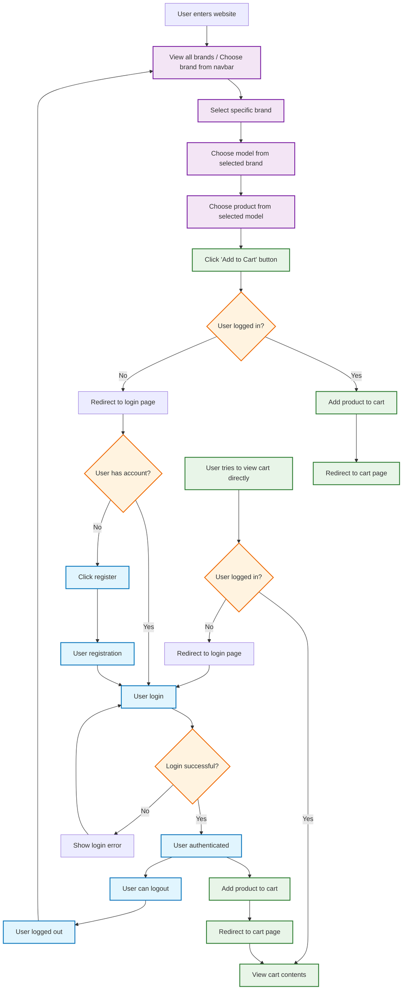

# Skinify Web


> 📇 **Skinify** - A web application that allows users to customize their phone's or gadget's appearance.

Skinify is an application designed to help users personalize their devices with various skins and themes. Whether you want to give your phone a fresh look or match your gadget to your style, Skinify has got you covered.

## Links

- 🌍 URL: [https://skinify.mchmdirvan.com/](https://skinify.mchmdirvan.com/)
- 📦 Repository: <https://github.com/mchmdirvan/skinify>

## Features

- ➕ Get Brands
- ➕ Get Models by Brand
- ➕ Get Products by Model
- ➕ Add to Cart
- ➕ View Cart
- ➕ Register
- ➕ Login
- ➕ Dashboard
- ➕ Logout

## Tech Stack

- React Router Frmamework V7
- Tailwind CSS
- Shadcn UI
- React Hook Form
- Zod

## Flowchart



## References

Todoist: [https://exacoat.com/](https://exacoat.com/)

[](https://stackblitz.com/github/remix-run/react-router-templates/tree/main/default)

## Features

- 🚀 Server-side rendering
- ⚡️ Hot Module Replacement (HMR)
- 📦 Asset bundling and optimization
- 🔄 Data loading and mutations
- 🔒 TypeScript by default
- 🎉 TailwindCSS for styling
- 📖 [React Router docs](https://reactrouter.com/)

## Getting Started

### Installation

Install the dependencies:

```bash
npm install
```

### Development

Start the development server with HMR:

```bash
npm run dev
```

Your application will be available at `http://localhost:5173`.

## Building for Production

Create a production build:

```bash
npm run build
```

## Deployment

### Docker Deployment

To build and run using Docker:

```bash
docker build -t my-app .

# Run the container
docker run -p 3000:3000 my-app
```

The containerized application can be deployed to any platform that supports Docker, including:

- AWS ECS
- Google Cloud Run
- Azure Container Apps
- Digital Ocean App Platform
- Fly.io
- Railway

### DIY Deployment

If you're familiar with deploying Node applications, the built-in app server is production-ready.

Make sure to deploy the output of `npm run build`

```
├── package.json
├── package-lock.json (or pnpm-lock.yaml, or bun.lockb)
├── build/
│   ├── client/    # Static assets
│   └── server/    # Server-side code
```

## Styling

This template comes with [Tailwind CSS](https://tailwindcss.com/) already configured for a simple default starting experience. You can use whatever CSS framework you prefer.

---

Built with ❤️ using React Router.
